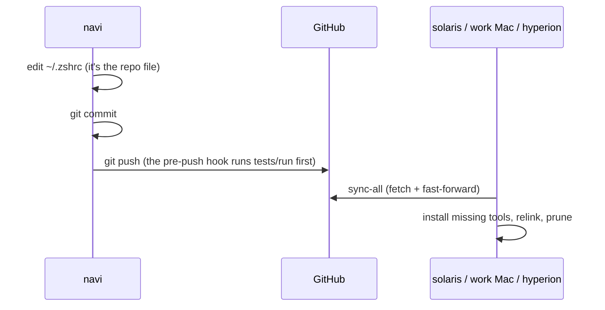

# How it works

## Files live in the repo; `$HOME` has symlinks

Every config file is stored once, in `~/dotfiles`. What your tools see in
`$HOME` are **symlinks** pointing back into the repo:

```text
~/.zshrc                        →  dotfiles/zsh/.zshrc
~/.config/zsh/20-aliases.zsh    →  ../../dotfiles/zsh/.config/zsh/20-aliases.zsh
~/.config/nvim/init.lua         →  ../../dotfiles/nvim/.config/nvim/init.lua
```

So there's nothing to "apply". Edit either path and you've edited the one file.
Git sees the change right away, and you commit it like any other code.

The links are made by [GNU Stow](https://www.gnu.org/software/stow/), or by
`dotfiles-sync`'s built-in equivalent on machines without stow. Each top-level
folder is a **package** laid out exactly like `$HOME`:

```text
dotfiles/
└── zsh/                      ← package "zsh"
    ├── .zshrc                → ~/.zshrc
    ├── .zshenv               → ~/.zshenv
    └── .config/zsh/
        └── 10-env.zsh        → ~/.config/zsh/10-env.zsh
```

Links are made **per file**, never per folder (`stow --no-folding`). So
`~/.config/zsh/` is a real folder holding one symlink per tracked file, and you
can drop untracked files next to them, such as `90-<host>.zsh`.

## One file per machine decides what it gets

Each machine has an untracked list, `~/.config/dotfiles/packages`, naming the
packages it uses. `install.sh` writes it from a profile the first time.

| Machine | `~/.config/dotfiles/packages` |
|---|---|
| navi (personal) | zsh p10k tmux git nvim lazygit atuin **personal ollama** |
| work Mac | zsh p10k tmux git nvim lazygit atuin |
| hyperion (NAS) | zsh p10k git |

That list drives everything: which packages get **linked**, which package
Brewfiles and pipx lists get **installed**. A package the work Mac doesn't list
never touches it, neither its files nor its software.

## Changes flow through Git



`sync-all` runs `dotfiles-sync`, then ai-sync's sync. Changes can start on any
machine; the command is the same everywhere.

## What is *not* in the repo

Anything machine-specific or secret: git identity, SSH hosts, per-host
aliases, tokens. Those live in [untracked files](../reference/untracked-files.md),
some of them created from `templates/`. The tracked config *includes* them
(git, zsh), so they can override it.

## Next

- [Packages and profiles](packages.md): what exactly makes a package.
- [What sync does](sync.md): every step, and what it will never do.
