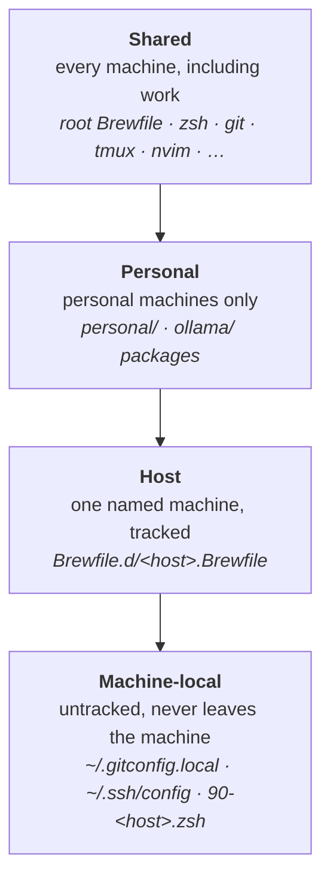

# Shared, personal, host, machine

Every setting and tool belongs to exactly one of four layers. Choosing the
layer is the only decision to make when adding something.

Software from every applicable layer is installed. For shell and git settings,
later layers load after earlier ones, so each can override the one before.

## Where does this go?

| I want… | Layer | Put it in |
|---|---|---|
| a CLI tool or app on every Mac, including work | shared | `Brewfile` |
| a tool on personal Macs only | personal | `personal/Brewfile` (the LLM stack: `ollama/Brewfile`) |
| a tool on one machine | host | `Brewfile.d/<host>.Brewfile` |
| a Python CLI on personal Macs | personal | `personal/pipx-tools.txt` |
| an alias / function / env var everywhere | shared | `zsh/.config/zsh/NN-name.zsh` |
| … on personal machines only | personal | `personal/.config/zsh/50-personal.zsh` |
| … on one machine | machine | `~/.config/zsh/90-<host>.zsh` (untracked) |
| … that must be set before oh-my-zsh loads | machine | `~/.zshrc.early.local` (untracked) |
| a git setting everywhere | shared | `git/.gitconfig` |
| git identity, or anything work-specific | machine | `~/.gitconfig.local` (untracked) |
| SSH hosts | machine | `~/.ssh/config` (untracked) |
| a token or password | — | never here: ai-sync's `secrets/` or the Keychain |
| config for a new tool | shared or personal | a [new package](../how-to/add-a-package.md) |

## Rules of thumb

- **When in doubt, it's not shared.** Shared means it lands on the work Mac.
  Would you be fine with your employer seeing it installed? If not, it's
  personal.
- **Anything with a name, address or credential in it is machine-local.** That
  includes hostnames, IPs, emails and tokens. The repo is public.
- **Guard optional tools.** Shared shell config runs on machines without the
  tool (hyperion, containers). Wrap it in `(( $+commands[tool] ))`; see
  [Add shell config](../how-to/add-shell-config.md).
- **Host files are tracked; `90-<host>.zsh` is not.** Use
  `Brewfile.d/<host>.Brewfile` for what a host installs (reproducible, shared
  via Git), and `90-<host>.zsh` for private per-host shell tweaks.

## How each layer is wired in

| Layer | Brew | Shell | Git |
|---|---|---|---|
| shared | root `Brewfile` on every Mac | `zsh` package | `git/.gitconfig` |
| personal | `<package>/Brewfile` where enabled | `personal/.config/zsh/*` | — |
| host | `Brewfile.d/<host>.Brewfile`, by host name | — | — |
| machine | — | `90-<host>.zsh`, `~/.zshrc.early.local` | `~/.gitconfig.local`, included **last** |

The host name is this Mac's configured name (`scutil --get HostName`, else
`LocalHostName`), lowercased. Every sync prints it as `host: …`.
