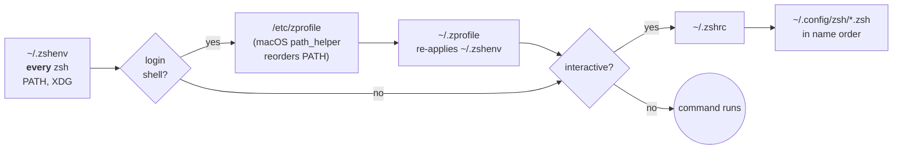

# Shell startup

## Which file runs when

zsh reads different files depending on how it starts. This repo uses each for
one job:



| File | Runs for | Job |
|---|---|---|
| `~/.zshenv` | every zsh, including `ssh host cmd`, scripts, launchd, agent subprocesses | **the only PATH definition**; XDG dirs |
| `~/.zprofile` | login shells (new terminal tabs, SSH logins) | re-sources `~/.zshenv`, because macOS `path_helper` pushed system dirs back in front |
| `~/.zshrc` | interactive shells | the loader, below |

### Why PATH lives in `.zshenv`

Commands run over SSH (`ssh solaris sync-all`), from launchd, or by coding
agents start a *non-interactive* shell, which reads only `.zshenv`. Defining
PATH there once means every kind of shell sees the same tools.

```zsh title="zsh/.zshenv"
--8<-- "zsh/.zshenv"
```

Entries that don't exist on a machine are dropped (`(N-/)`), so one list serves
the Macs, QNAP and Linux. Duplicates are removed automatically.

## What `.zshrc` does

1. Sources `~/.zshrc.early.local`, if present. It's untracked; use it for
   `ZSH_THEME` or `POWERLEVEL9K_*` settings that must exist before
   oh-my-zsh loads.
2. Starts the powerlevel10k **instant prompt**, so the prompt appears
   immediately.
3. Sets the completion path: `~/.cache/zsh/completions` and Homebrew's.
4. Loads oh-my-zsh with the plugins `git`, `vscode`, `zsh-autosuggestions`,
   `zsh-syntax-highlighting`, plus `macos` on macOS.
5. Sources **every** `~/.config/zsh/*.zsh` in name order.
6. Sources `~/.p10k.zsh` (prompt layout).

## The modular files

Name order is load order, so the number prefix matters.

| File | Package | Does |
|---|---|---|
| `05-devcontainer.zsh` | zsh | containers only (`DEVCONTAINER=1`): first-run tool install |
| `10-env.zsh` | zsh | `EDITOR`/`VISUAL` (nvim → vim → vi), `BAT_THEME`, `LESS`, `NVM_DIR` |
| `12-github-cli.zsh` | zsh | exports `GH_TOKEN` from ai-sync's PAT, if that file exists |
| `16-llm-gateway.zsh` | ollama | `LITELLM_BASE_URL`, per-tool LiteLLM keys |
| `20-aliases.zsh` | zsh | aliases for optional tools, each guarded |
| `30-completions.zsh` | zsh | kubectl completion (cached), kubecolor |
| `40-tools.zsh` | zsh | `copilot` wrapper; fzf, atuin, zoxide integrations (cached init) |
| `50-personal.zsh` | personal | Copilot telemetry, media and VPN aliases |
| `60-aider-wrapper.zsh`, `61-goose-wrapper.zsh` | ollama | pass each tool its own API key |
| `70-nvm.zsh` | zsh | lazy nvm: loads on first `node`/`npm`/… |
| `90-<host>.zsh` | *untracked* | your per-host overrides, loaded last |

Numbering is shared across packages, so choose a number that puts your file
where it needs to load. Anything that overrides earlier settings goes high.

## Keeping startup fast

- The fzf, atuin and zoxide init scripts are **cached** in `~/.cache/zsh/`, and
  rebuilt only when the tool's binary is newer than the cache.
- The kubectl completion is generated once into `~/.cache/zsh/completions/`.
- nvm is **lazy**: calling `node`, `npm`, `npx`, `yarn`, `pnpm` or `nvm`
  loads it (saving ~400 ms per shell).
- The powerlevel10k instant prompt draws before the rest loads.

## Graceful degradation

Every alias and integration for an optional tool is guarded, so a machine
without the tool keeps the real command and prints no errors. The same files
therefore run unchanged on a fully tooled Mac, hyperion, and a bare container.
The end-to-end test starts real shells and fails on *any* error output.
