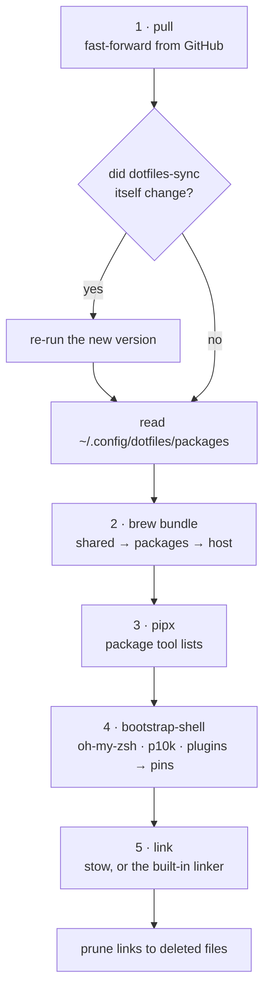

# What sync does

`sync-all` runs two things in order:

| Step | Repo | Script |
|---|---|---|
| 1 | `~/dotfiles` | `bin/dotfiles-sync` (this page) |
| 2 | `~/code/ai-sync` | `bin/ai-config-sync` (skipped if ai-sync isn't cloned) |

Use `sync-all dotfiles` or `sync-all ai-sync` to run just one.

## `dotfiles-sync`, step by step



### 1. Pull

`git fetch`, then `git merge --ff-only`. It **skips the pull, warns, and
carries on** when:

| Situation | Message |
|---|---|
| uncommitted changes to tracked files | `uncommitted changes … skipping pull` |
| you have local commits and upstream has others | `local and upstream have diverged` |
| no network | `git fetch failed (offline?)` |
| the branch has no upstream | `has no upstream` |

Local commits that aren't pushed yet are reported (`N local commit(s) not
pushed yet`) but don't block anything. It never rebases, merges or stashes for
you.

If the pull brought a new version of `dotfiles-sync`, the script restarts
itself so the rest runs the new logic.

### 2. Homebrew

When `brew` exists, it runs `brew bundle --no-upgrade` for, in order:

1. `Brewfile`, the shared set;
2. `<package>/Brewfile` for each **enabled** package that has one;
3. `Brewfile.d/<host>.Brewfile` for this host, if the file exists.

`--no-upgrade` means **install what's missing, change nothing else**. It never
upgrades or removes anything. Run `brew upgrade` yourself when you want that.
A failing Brewfile, for example on a macOS beta Homebrew doesn't know yet, is
reported and the sync continues.

### 3. pipx

For each enabled package with a `pipx-tools.txt`, it installs the entries that
`pipx list` doesn't show yet. Names are compared the way pip compares them
(`Foo_Bar` equals `foo-bar`). Upgrades stay manual.

### 4. Shell framework

Runs [`bootstrap-shell`](shell-framework.md). It only needs git, so it runs
on every host, including hyperion.

### 5. Link

For each enabled package:

- **with stow:** `stow --no-folding -R` (re-link; a no-op when nothing changed);
- **without stow** (hyperion): the built-in linker creates the same per-file
  symlinks (absolute rather than relative) and follows the same ignore rules.

Then it deletes **broken** symlinks that point into the repo, in `~`,
`~/.config` and `~/bin`. That is how a file deleted or renamed upstream
disappears from every machine.

## Safety rules

What `dotfiles-sync` will never do:

- **Overwrite your files.** A real file, or a symlink to somewhere else, where
  a link should go is reported and left alone; the sync ends with an error
  listing the packages that couldn't link. Only `install.sh` (via
  `--backup-conflicts`) moves such files aside, as `<file>.pre-dotfiles`.
- **Delete anything except broken links into the repo.**
- **Upgrade or uninstall software.**
- **Touch packages this machine doesn't list.**
- **Guess.** With no package list, it stops.

## Output, annotated

```text
[dotfiles-sync] fetching…
[dotfiles-sync] pulling 2 new commit(s)
[dotfiles-sync] packages: zsh p10k tmux git nvim lazygit atuin personal ollama
[dotfiles-sync] host: navi                          # picks Brewfile.d/navi.Brewfile
[dotfiles-sync] brew bundle Brewfile
[dotfiles-sync] brew bundle personal/Brewfile
[dotfiles-sync] brew bundle ollama/Brewfile
[dotfiles-sync] brew bundle Brewfile.d/navi.Brewfile
[dotfiles-sync] converging shell framework (…)
[bootstrap-shell] oh-my-zsh: at pin (c954bbb)
…
[dotfiles-sync] linking with stow…
[dotfiles-sync] removed stale link ~/.config/zsh/70-nvm.zsh
[dotfiles-sync] done.
```

## Running it unattended

`sync-all` runs fine from launchd or cron. It adds Homebrew to PATH if it's
missing, and a dirty tree or no network just skips the pull. To enable it, add
a LaunchAgent that runs `$HOME/dotfiles/bin/sync-all` (use the absolute path)
with a `StartInterval`, for example 3600. It isn't enabled by default.
