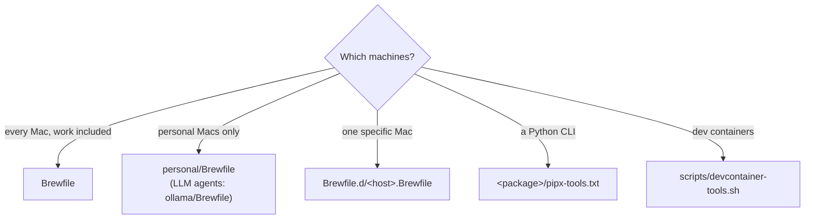

# Add a tool

First decide **which machines** should have it. That choice picks the file.



## Homebrew formula or cask

1. Add one line to the right Brewfile, in the section it belongs to, with a
   short comment saying why it's there:

    ```ruby title="Brewfile"
    brew "hyperfine"                           # command benchmarking
    cask "rectangle"                           # window snapping
    ```

2. Install it here without waiting for a sync:

    ```bash
    brew bundle --no-upgrade --file=~/dotfiles/Brewfile
    ```

3. Commit and push. Every machine that uses that Brewfile installs it on its
   next `sync-all`.

!!! warning "Third-party taps need `trusted:`"
    Homebrew refuses formulae from taps you haven't trusted. Declare the trust
    next to the tap, scoped to the formulae you use:

    ```ruby
    tap "jesseduffield/lazygit", trusted: { formula: "lazygit" }
    brew "jesseduffield/lazygit/lazygit"
    ```

!!! info "Don't use `brew bundle dump`"
    It writes every dependency and every one-off install into the file. Keep
    the Brewfiles curated by hand: top-level things you actually want.

## Python CLI (pipx)

Homebrew's Python refuses `pip install` (PEP 668), so Python CLIs go through
pipx. Add a line to the package's `pipx-tools.txt`, usually
`personal/pipx-tools.txt`:

```text title="personal/pipx-tools.txt"
# <name as `pipx list` shows it>  [<pip spec>]
httpie
my-tool git+https://github.com/someone/my-tool@3f2c1e0d9a…   # pin git installs to a commit
```

The first field is the name `pipx list` reports; sync skips it if already
installed. The optional second field is what to install: a PyPI name, a
version spec or a `git+https://…@<commit>` URL. Pin git specs to a commit,
because that code runs as you.

Need it on every machine? Give a shared package a `pipx-tools.txt`, or create
a package for it (see [Add a package](add-a-package.md)).

## Only in dev containers

Add an installer function to `scripts/devcontainer-tools.sh`, following the
existing ones. Use the `latest` helper for the release tag, and `install_bin`
for a tarball containing one binary. Check the tool's release asset names for
**both** `x86_64` and `aarch64`. Then register it with `tool <command> <function>`.

## Does it need config or an alias?

- A config file → [Add or change a config file](add-or-change-config.md).
- An alias or integration → [Add shell config](add-shell-config.md). Remember
  to guard it, because machines without the tool also load that file.
- Its own opt-in bundle of config plus software → [Add a package](add-a-package.md).
