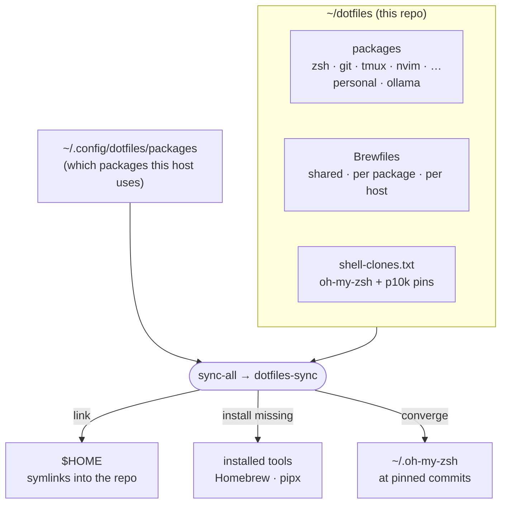

# dotfiles

One Git repo that sets up and keeps in sync **every machine I use**: personal
Macs, the work Mac, a QNAP NAS, and Linux dev containers.

-   :material-rocket-launch: **Set up a machine**

    ---

    A new Mac takes three commands.

    [:octicons-arrow-right-24: Getting started](getting-started/index.md)

-   :material-sync: **Use it day to day**

    ---

    Edit, commit, push, then `sync-all` everywhere else.

    [:octicons-arrow-right-24: Everyday workflow](how-to/daily-workflow.md)

-   :material-plus-box: **Add something**

    ---

    A tool, a config file, an alias, a whole package.

    [:octicons-arrow-right-24: How-to guides](how-to/index.md)

-   :material-lightbulb-on: **Understand it**

    ---

    Packages, profiles, what sync does, and why.

    [:octicons-arrow-right-24: Concepts](concepts/index.md)

## What you get

- **The same environment everywhere.** The shell (zsh, oh-my-zsh,
  powerlevel10k), aliases, tmux, git, Neovim, lazygit, atuin, and a shared set of
  CLI tools. SSH into any box and it feels like the laptop you just left.
- **Personal stays personal.** Personal-only software and settings live in
  opt-in *packages* that the work machine never enables. Work identity and other
  machine-specific settings stay in untracked local files.
- **One command to converge.** Change something anywhere, commit, push; every
  other machine picks it up with `sync-all`. That covers new, edited, renamed
  and deleted files, and new tools.
- **Safe by default.** Sync never overwrites your files, never upgrades or
  uninstalls software, and still works offline or with uncommitted edits.

## The whole thing in one picture

Files in `$HOME` are **symlinks** into the repo, so editing `~/.zshrc` *is*
editing `~/dotfiles/zsh/.zshrc`. Commit and push, and the other machines follow.

## Where to go next

| I want to… | Read |
|---|---|
| set up a new Mac | [New Mac](getting-started/new-mac.md) |
| update a machine that used the old layout | [Updating an existing machine](getting-started/existing-machines.md) |
| know where to put something | [Shared, personal, host, machine](concepts/layers.md) |
| install a new tool everywhere, or only on personal Macs | [Add a tool](how-to/add-a-tool.md) |
| add an alias | [Add shell aliases, functions, env](how-to/add-shell-config.md) |
| use a different git identity at work | [Keep work and personal apart](how-to/work-machine.md) |
| look up a command, alias or key binding | [Reference](reference/index.md) |
| fix something that went wrong | [Troubleshooting](troubleshooting.md) |
