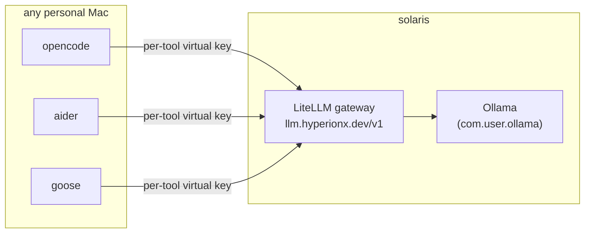

# Local LLM stack (`ollama` package)

Personal machines only. It holds client config for the local-model setup: the
models run on **solaris** behind a LiteLLM gateway, and the other Macs connect
to it over the tailnet.



## What it links

| File | Purpose |
|---|---|
| `.config/zsh/16-llm-gateway.zsh` | sets `LITELLM_BASE_URL`; loads per-tool keys into `OPENCODE_/AIDER_/GOOSE_LITELLM_KEY` (file first, then macOS Keychain) |
| `.config/zsh/60-aider-wrapper.zsh`, `61-goose-wrapper.zsh` | give each tool its own key as `OPENAI_API_KEY`, for that process only |
| `.config/opencode/opencode.jsonc`, `AGENTS.md` | opencode: gateway provider and model list, MCP servers, permission gates |
| `.aider.conf.yml` | aider: architect `local/qwen3-14b-0x`, editor `local/qwen2.5-coder-7b-0x` |
| `.config/goose/config.yaml` | goose: `local/granite4.1-8b-0x`, `smart_approve` mode |
| `bin/litellm-keys` → `~/bin/` | key management |

Its `Brewfile` installs aider, opencode and goose.

!!! info "Why `OPENAI_API_KEY` is never exported globally"
    opencode enables every provider whose API-key variable it finds, which would
    fill its model picker with hosted models we don't use. So opencode reads its
    key from a file (`{file:…}` in `opencode.jsonc`), and aider and goose get
    theirs through wrapper functions.

## Daily use

| Command | Behavior |
|---|---|
| `opencode` | TUI agent. Default model `auto`; switch with `/models` |
| `aider` | architect mode (a reasoner plans, a coder edits) |
| `goose` | MCP-heavy agent; `GOOSE_MODEL=local/qwen3-14b-0x goose session` for the stronger model |

Which local models handle tool calling (verified 2026-05-26):

- **agent loops:** `local/granite4.1-8b-0x` (default), `local/qwen3-14b-0x`,
  `local/qwen3-abliterated-8b-0x`, `local/gemma4-e4b-0x`
- **chat only:** `local/deepseek-r1-14b-0x`, `local/llama3.2-vision-11b-0x`,
  `local/dolphin3-8b-0x`
- **completion, not agents:** `local/qwen2.5-coder-7b-0x`

`opencode.jsonc` records this as `tools: true/false` per model.

## `litellm-keys`

Keys live in `~/.copilot/secrets/litellm-<tool>.txt` (the per-machine copy
the shell reads) and in the macOS Keychain as `litellm-<tool>` (synced between
Macs by iCloud Keychain).

| Command | Does |
|---|---|
| `litellm-keys list` | shows which keys exist in the file and in the Keychain |
| `litellm-keys pull [tool…]` | Keychain → files. **Run this on a new Mac.** |
| `litellm-keys push [tool…]` | files → Keychain |
| `litellm-keys mint <tool> [--budget USD] [--duration 30d]` | create a new virtual key (needs the master key), save it to the file and the Keychain |
| `litellm-keys revoke <tool>` | delete the key on the server, in the file and in the Keychain |

Known tools: `opencode aider goose openwebui master-key`. The master key is
for administration only and is never exported to tools.

## The Ollama server (solaris)

Homebrew's `ollama` bottle ships without the `llama-server` runner, so every
model load fails. solaris runs the official build instead, as a LaunchAgent.
Neither file is linked into `$HOME`.

```bash
# install / upgrade (pass a version to pin)
~/dotfiles/ollama/bin/install-ollama.sh 0.30.7

# enable the service
ln -sf ~/dotfiles/ollama/launchagents/com.user.ollama.plist ~/Library/LaunchAgents/
launchctl unload ~/Library/LaunchAgents/com.user.ollama.plist 2>/dev/null
launchctl load -w ~/Library/LaunchAgents/com.user.ollama.plist

# check / restart
launchctl print gui/$(id -u)/com.user.ollama | grep state
curl -s http://localhost:11434/api/tags | jq '.models | length'
launchctl kickstart -k gui/$(id -u)/com.user.ollama
```

The agent waits for the models SSD (`/Volumes/Helio`), serves on
`0.0.0.0:11434` (reachable from Docker and the tailnet), and restarts on
crash. Its tuning (flash attention, q8 KV cache, 32k context, one model loaded
at a time) is set in the plist.

The model list, naming scheme (`<scope>/<name>-<version>-<cost>x`) and gateway
setup are documented in the homelab repo (`docs/models.md`,
`docs/llm-clients.md`).
